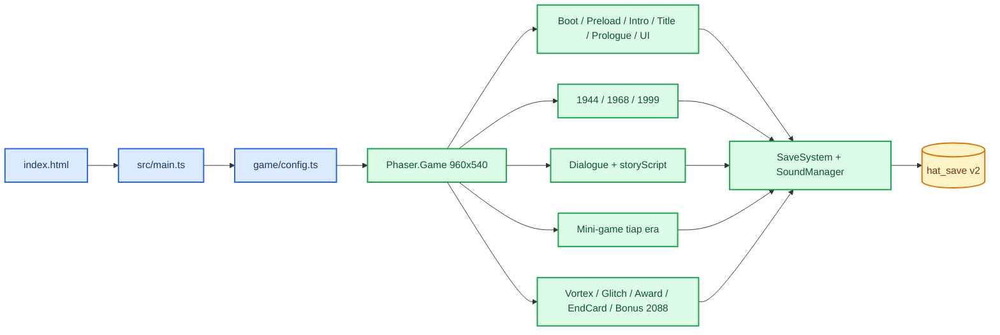
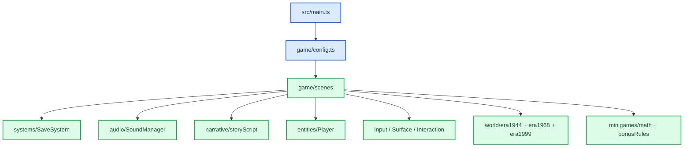
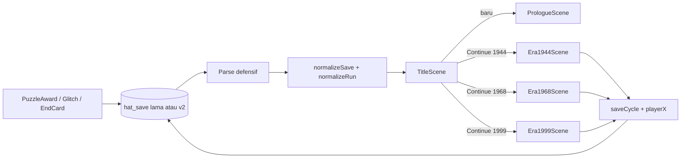

# Arsitektur Hearts Across Time

_Kontrak runtime produksi Phaser 4.2.1 berdasarkan source saat ini._

---

## 🏗️ Runtime tingkat tinggi

Game memiliki satu entry produksi:

- `index.html` memuat `src/main.ts` melalui Vite.
- `src/main.ts` membuat `Phaser.Game` dari konfigurasi tunggal di
  `src/game/config.ts`.
- Seluruh era, dialog, mini-game, loop, enam ending, dan bonus berjalan di scene
  TypeScript/Phaser.
- `legacy/index.html` dan classic-script lama hanya referensi/parity regression dan tidak
  termasuk build `dist/`.



Background, sprite, world object, UI, dialog, dan mini-game adalah Phaser Game Object.
Arcade Physics memiliki fixed step 60 FPS; Scale FIT menjaga kanvas logis 960×540 pada
viewport berbeda. Runtime produksi tidak bergantung pada `POST_RENDER` atau global
classic-script.

## 🎬 Scene produksi

| Wilayah | Scene |
| --- | --- |
| Bootstrap dan loader | `BootScene`, `PreloadScene` |
| Intro, sampul, prolog | `IntroScene`, `TitleScene`, `PrologueScene` |
| Traversal era | `Era1944Scene`, `Era1968Scene`, `Era1999Scene` |
| UI dan dialog | `UIScene`, `DialogueScene` |
| 1944 | `WatchRepairScene`, `SpotlightChallengeScene` |
| 1968 | `RosePuzzleScene`, `SignalTuneScene`, `DiaryScene` |
| 1999 | `GemAlignScene`, `PhotoPuzzleScene`, `CryoBalanceScene` |
| Transisi dan hasil | `VortexScene`, `GlitchScene`, `PuzzleAwardScene`, `EndCardScene` |
| Epilog | `Bonus2088Scene` |

Daftar di `game/config.ts` adalah sumber kebenaran registrasi dan urutan bootstrap.
Scene dapat meluncurkan scene modal seperti UI, dialog, atau mini-game, tetapi scene era
tetap owner state dunia, reward, autosave, dan transisi.

## 🔗 Dependency TypeScript



`BootScene` membuat `SaveSystem` dan `SoundManager`, membaca opsi, lalu menyimpan
service dan `reduceMotion` di registry Phaser. Scene lain mengambil instance yang sama;
tidak ada global gameplay di luar Phaser.

## 🌍 Gameplay tiga era

Definisi `game/world/era1944.ts`, `era1968.ts`, dan `era1999.ts` menyimpan ukuran
dunia, spawn, surface, object, sensor, visual, condition, action, dan material.
`WorldFactory` membuat Game Object/body dari data. `InteractionSystem` menghasilkan
object aktif, prompt, dan action simbolik; scene era memutuskan mutasi run, reward,
save, mini-game, dialog, serta perpindahan era.

`Player` adalah `Phaser.Physics.Arcade.Sprite` dengan body kaki. Ia menangani
akselerasi, drag, arah, animasi, langkah, dan penghentian saat terblokir. Kamera Phaser
mengikuti pemain dalam world bounds. `InputSystem` menyatukan keyboard dan intent
sentuh, sedangkan `UIScene` memiliki HUD, prompt, kontrol sentuh, mute, dan pause.

Alur wajib produksi:

1. 1944: perbaikan arloji → tantangan lampu sorot → dialog/rute Arthur.
2. 1968: botol mawar → penyetelan sinyal → buku harian/dialog rute.
3. 1999: penyelarasan permata → puzzle foto → stabilisasi krio → keputusan akhir.
4. Ending gagal memberi pecahan melalui `PuzzleAwardScene`, lalu
   `GlitchScene` menaikkan loop dan kembali ke 1944.
5. True ending membuka `EndCardScene`. Keenam ending
   (`A1`, `B1`, `B2lock`, `rebut`, `paradox`, `true`) membuka
   `Bonus2088Scene`.

Assist mini-game, pause, keyboard/touch, fallback aset, dan reduced motion adalah bagian
kontrak, bukan tambahan opsional.

## 📖 Narasi dan rute

`game/narrative/storyScript.ts` adalah implementasi narasi aktif. Ia mendefinisikan
operasi `say`, `choice`, `goto`, `walk`, `item`, `fx`, `vortex`, dan
`ending`, termasuk resolver yang bergantung pada `RunState`.

`DialogueScene` menafsirkan operasi tersebut, menampilkan teks/pilihan/backlog,
menjalankan efek pilihan, menyimpan progres yang relevan, dan mengembalikan hasil
kepada scene pemilik. `VortexScene` menangani transisi era; `PuzzleAwardScene`,
`GlitchScene`, dan `EndCardScene` menangani hasil rute.

Perubahan cerita wajib mencocokkan `docs/design/FIRST_IDEA.md`, `docs/design/DIALOG.md`, dan node aktif di
`storyScript.ts`. Jangan menaruh mutasi narasi di renderer atau menggandakan skrip
cerita di file lain.

## 🧠 State ownership

| State | Owner | Aturan |
| --- | --- | --- |
| Lifecycle/display | Masing-masing Phaser Scene | Scene membuat dan menghancurkan Game Object miliknya |
| Input frame | `InputSystem` | Membaca keyboard/touch menjadi intent; bukan owner cerita |
| State satu siklus | `RunState` | Dimutasi scene gameplay pemilik lalu disimpan lewat `SaveSystem` |
| Save permanen | `SaveSystem` | Trust boundary parse, normalisasi, migrasi, dan persist `hat_save` |
| Operasi narasi | `storyScript.ts` | Data/aturan dialog dan rute; dieksekusi `DialogueScene` |
| Audio lintas scene | `SoundManager` | Musik, ambience, SFX, mute, ducking, dan shutdown |
| State debug | Registry `nativeState` | Label observasi, bukan sumber kebenaran gameplay |

Renderer tidak boleh menjadi owner mutasi gameplay. World object menyajikan visual,
collision, dan action simbolik; reward, save, serta perpindahan scene berada di scene
atau service domain.

## 💾 Save dan Continue

Runtime produksi memakai localStorage key `hat_save` dengan `saveVersion: 2`.
`SaveSystem` menerima JSON lama/tanpa versi secara defensif, menormalisasi era,
route, challenge, inventory, target puzzle, ending, dan posisi pemain, lalu menyimpan
bentuk canonical.



Field sementara seperti sprite, body fisika, input, timer, audio node, dan Game Object
tidak disimpan. Field baru wajib memiliki default aman, normalisasi, dan unit test.
Jangan membuat key save paralel.

## 🧱 Runtime referensi

`legacy/index.html` dan seluruh classic-script di `legacy/src/` dipertahankan untuk inspeksi historis dan
`npm run qa:legacy`. Runtime itu:

- bukan entry deploy;
- bukan fallback Continue;
- tidak diimpor bundle TypeScript;
- tidak disalin oleh `npm run build`;
- tidak menerima fitur produksi baru kecuali tugas secara eksplisit menargetkan parity.

Perbedaan objektif dapat dibandingkan dengan GDD dan suite regression, tetapi perbaikan
produk dilakukan pada owner TypeScript.

## 🔍 Observasi, QA, dan distribusi

`window.__HAT.snapshot()` mengekspos snapshot serializable scene aktif, renderer,
`nativeState`, dan detail scene relevan. Ini hook QA/debug, bukan API gameplay.
`?physicsDebug=1` mengaktifkan overlay Arcade Physics; `?qa=1` melewati intro untuk
fixture Playwright.

```sh
npm run typecheck
npm run lint
npm run test:unit
npm run build
npm run qa:smoke
npm run qa:visual
npm run qa
npm run qa:legacy
```

`npm run qa` menjalankan suite Playwright native di `tests/e2e/`.
`npm run qa:legacy` menjalankan parity regression dari `tests/legacy/`.
`npm run build` memakai `index.html` sebagai satu-satunya Rollup input dan menyalin
`assets/`; hasil `dist/` berisi entry/bundle native dan aset produksi saja.
