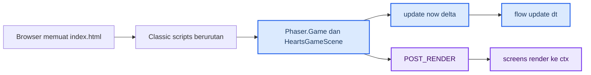
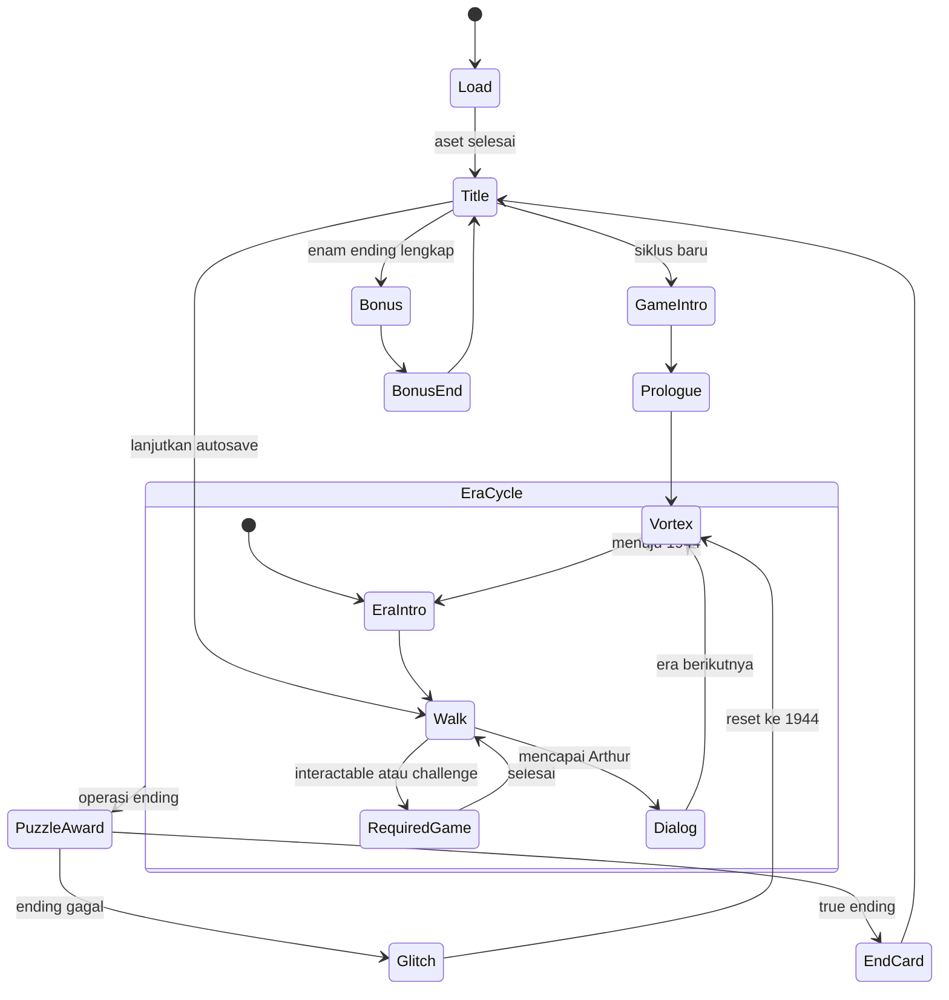
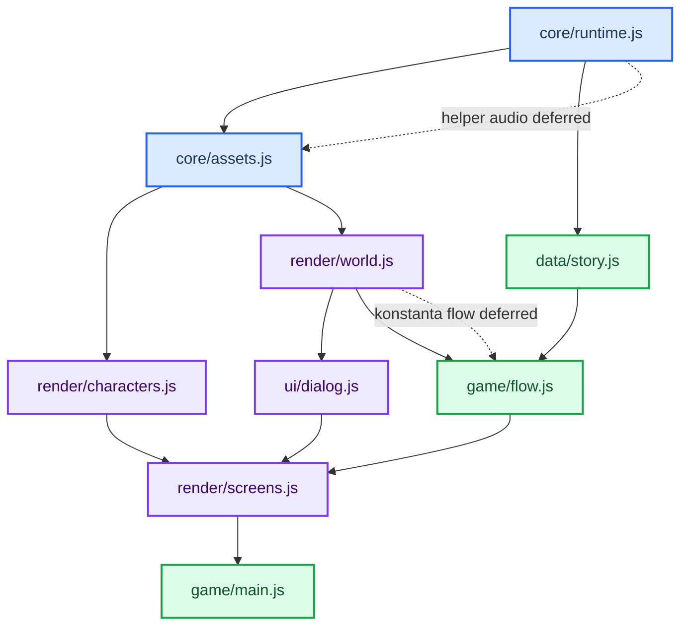
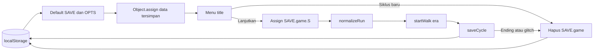
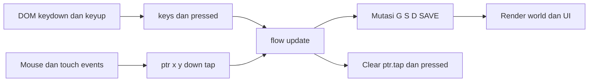

# Arsitektur Hearts Across Time

_Kontrak runtime modular Phaser 4.2.1 + Canvas 2D berdasarkan source saat ini._

---

## 🏗️ Runtime tingkat tinggi

`index.html` menyediakan canvas 960×540, overlay video intro, Phaser vendored, dan urutan classic-script. Tidak ada module loader atau build step.

`HeartsGameScene.update()` membatasi delta ke 0–0,05 detik. `drawGame()` memanggil `render()` setelah render Phaser. `window.__HAT` mengekspos referensi debug ke game, scene, `G`, `S`, `D`, dan `AS`; bukan API save atau integrasi stabil.

Ownership runtime tetap hibrida:

- Phaser memiliki scene lifecycle, clock frame, canvas game, Scale FIT/CENTER_BOTH, dan `POST_RENDER`.
- `runtime.js::fit()` masih menulis ukuran CSS canvas pada resize.
- `G.paused`/`setPaused()` membekukan update gameplay dan men-duck audio; Phaser scene tetap aktif.
- `visibilitychange` di `main.js` menangguhkan/melanjutkan WebAudio sesuai visibilitas dan pause.

## 🔄 State machine

`G.state` adalah discriminator utama. `src/game/flow.js::update()` memutasi state; `src/render/screens.js::render()` memilih tampilan dari nilai yang sama.

`EraIntro` mewakili `warintro`, `bunkerintro`, `labintro`, atau `finallabintro`. `RequiredGame` mewakili `challenge`, `watchrepair`, `rosepuzzle`, `gemalign`, atau `photopuzzle`. `walk` juga dapat ditahan modal `G.diary` atau `G.lore` tanpa mengganti `G.state`.

Pause bukan state machine terpisah: `G.paused` menginterupsi hampir semua state interaktif dan mengarahkan frame ke `updatePause()`/`drawPause()`.

## 🔗 Dependency modul

Ini bukan dependency graph ESM. Semua simbol berada di global lexical scope classic-script; reorder, rename global, atau menambah `type="module"` dapat memutus runtime.

## 🧠 State ownership dan mutasi

| Store | Owner utama | Umur dan aturan |
| --- | --- | --- |
| `G` | `core/runtime.js`, dimutasi `game/flow.js` | State scene/UI sementara. Setter/transisi baru ditempatkan di flow, bukan renderer |
| `S` | `core/runtime.js`, dimutasi choice/flow | Data satu siklus; affinity, route, loop, challenge, inventory, puzzle wajib |
| `D` | `game/flow.js` | Cursor dan presentasi dialog aktif; `step()` satu-satunya interpreter operasi cerita |
| `SAVE` | `core/runtime.js` | Progres lintas sesi dan `SAVE.game`; persist hanya melalui `persistSave()` |
| `OPTS` | `core/runtime.js` | Opsi user lintas sesi; persist melalui `saveOpts()` |
| `AS` | `core/assets.js` | Hasil load image/font; error aset valid dan mengaktifkan fallback |
| `AU` | `core/runtime.js` | WebAudio context, bus, ambience, buffer; dibuat setelah gesture |
| `T` | `core/runtime.js`/flow | Waktu global detik yang bertambah saat `update()` aktif |
| `LOG`, `ECHO` | `game/flow.js` | Riwayat dialog dan jejak loop selama tab hidup; tidak disimpan |

Aturan baru: input menghasilkan intent, flow memutasi state, renderer membaca state. Jangan menambah write ke `G`, `S`, `SAVE`, atau `OPTS` dari fungsi draw.

Pengecualian legacy saat ini:

- `drawParts(c, 1/60)` memajukan dan menghapus `parts` pada render, sehingga kecepatan partikel bergantung frame render.
- `drawLensRain()` memindahkan `lensDrops` dan dapat mengacak posisi reset.
- `poseFade()` menulis timestamp awal ke `D._poseBorn`.
- `drawLog()` meng-clamp `G.logScroll`.

Jangan memperluas pola ini. Diagnosis frame-rate/render harus mempertimbangkan pengecualian tersebut.

## 🎨 Rendering pipeline

Urutan umum `render()`:

1. Simpan context, terapkan shake bila motion aktif, lalu clear canvas.
2. Pilih branch layar dari `G.state`.
3. Untuk `walk`/`dialog`, gambar background dan props melalui `drawScene()`, karakter, loop ghost, foreground PNG atau `fgSilhouette()`, grade, lalu post-FX.
4. Gambar indikator/interactable, caption, dialogue/choice, touch controls, loop HUD, inventory, dan toast di atas dunia.
5. Gambar overlay global: backlog, fade, white flash, pause, pause/mute buttons.
6. Restore context. Phaser menampilkan canvas yang sama setelah `POST_RENDER` selesai.

Kontrak fallback:

- `drawCharSheet()` false → `drawElena()`/`drawArthur()` prosedural.
- `bgLayerImg()` false → fungsi background prosedural tetap menggambar layer.
- `bgFgImg()` false → `fgSilhouette()`.
- Ilustrasi puzzle/cover/vortex harus memiliki bentuk prosedural atau komposisi lama; potret opsional boleh tidak digambar.
- Audio file gagal → fetch error ditelan; SFX yang mendukungnya memakai synth/noise fallback, ambience file boleh senyap.

`OPTS.reduceMotion` harus menghasilkan frame stabil tanpa menghapus informasi, state, atau kontrol. Matikan atau batasi camera drift/zoom, bob, mouth flap, shake, RGB split, moving scanlines, rain particles, pulse, dan transisi non-esensial. Video `intro.mp4` tetap prarender dan tidak diubah oleh opsi ini.

## 💾 Save dan load

- `hat_save` memuat `seen`, `chosen`, `game`, `endings`, `inspected`, `introDone`, `tutorial`, dan key tambahan yang sudah ada seperti bonus/lore.
- `SAVE.game` hanya memuat `era` dan subset `S` yang di-whitelist `saveCycle()`.
- `normalizeRun()` mengisi challenge/inventory default dan meng-upgrade completion item dari save lama secara defensif.
- Ending/glitch menghapus `SAVE.game` agar Continue tidak menghidupkan kembali siklus selesai/runtuh.
- Tidak ada `saveVersion` pada source saat ini. Field baru wajib punya default, normalisasi save lama, dan migrasi eksplisit bila arti key berubah.

## ⌨️ Input keyboard dan touch

- `keys` menyimpan hold; `pressed` dan `keyOnce()` menyimpan edge satu frame.
- `ptr.down` menyimpan hold; `ptr.tap` adalah edge dan selalu dibersihkan pada akhir `update()`.
- `cvXY()` memetakan pointer dari ukuran CSS canvas ke koordinat 960×540.
- Input state-specific dikonsumsi di `flow.js`; kontrol touch yang tampak digambar di `screens.js` memakai hit area yang sama.
- Tombol mute/pause disentuh dalam `update()` sebelum `ptr.tap` dibersihkan. Tombol `M` juga dikonsumsi `HeartsGameScene.update()` sebelum flow.
- Menambah kontrol wajib menjaga keyboard dan touch parity serta tidak membuat beberapa consumer memakai edge yang sama tanpa urutan eksplisit.
