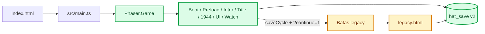
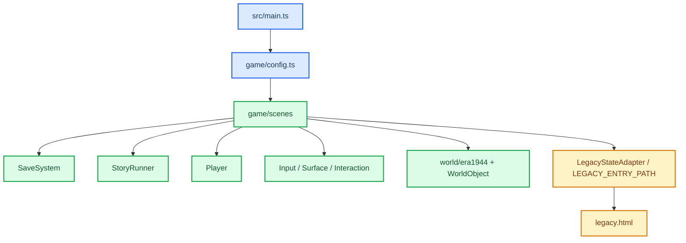
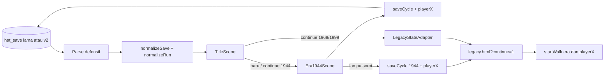

# Arsitektur Hearts Across Time

_Kontrak runtime strangler Phaser 4.2.1 berdasarkan source saat ini._

---

## 🏗️ Runtime tingkat tinggi

Game memiliki dua entry yang sengaja dipertahankan selama migrasi:

- `index.html` adalah runtime utama Phaser-native berbasis TypeScript/ESM dan Vite.
- `legacy.html` adalah runtime Canvas/classic-script lengkap untuk cerita yang belum
  dipindahkan.



Runtime native tidak memanggil renderer Canvas lama pada `POST_RENDER`. Background,
sprite, world object, UI, dan mini-game arloji adalah Phaser Game Object. `POST_RENDER`
tetap ada hanya di halaman legacy.

## 🎬 Status migrasi scene

| Wilayah | Runtime saat ini | Status |
| --- | --- | --- |
| Boot dan normalisasi save | `BootScene` | Native |
| Loader aset | `PreloadScene` | Native |
| Intro video | `IntroScene` | Native |
| Sampul/menu | `TitleScene` | Native |
| Traversal 1944 sampai lampu sorot | `Era1944Scene` | Native |
| HUD, prompt, touch, pause | `UIScene` | Native |
| Perbaikan arloji | `WatchRepairScene` | Native |
| Tantangan lampu sorot dan lanjutan 1944 | `legacy.html?continue=1` | Belum dimigrasikan |
| Era 1968 dan 1999 | `legacy.html` | Belum dimigrasikan |
| Dialog/rute lengkap | `legacy.html` | Belum dimigrasikan |
| Mini-game selain arloji | `legacy.html` | Belum dimigrasikan |
| Loop, ending, dan bonus | `legacy.html` | Belum dimigrasikan |

Tombol **Kisah Lengkap / Era Legacy** di title memberi jalur eksplisit ke runtime lama.
Continue untuk save era 1968/1999 masuk melalui `LegacyStateAdapter`. Handoff traversal
1944 memakai `LEGACY_ENTRY_PATH` setelah menyimpan era dan posisi pemain.

## 🔗 Dependency native



`game/config.ts` adalah satu-satunya tempat daftar scene dan konfigurasi Arcade
Physics. `BootScene` membuat service berumur sepanjang game dan menyimpannya di
registry Phaser. Scene lain mengambil service yang sama dari registry; tidak ada global
classic-script yang diimpor ke runtime native.

## 🌍 Vertical slice 1944

`game/world/era1944.ts` adalah sumber geometri native untuk ukuran dunia, spawn,
surface, arloji, lampu sorot, lore, dan Arthur. `WorldFactory` membuat Game Object dari
data tersebut. `InteractionSystem` hanya menghasilkan object aktif, prompt, dan action;
scene tetap owner mutasi run, save, mini-game, dan transisi.

Elena adalah `Phaser.Physics.Arcade.Sprite` dengan body kaki 24×12. `Player` menangani
akselerasi, drag, jalan/lari, arah sprite, animasi, langkah, dan penghentian pada body
yang terblokir. `SurfaceSystem` membuat static body dan collider. Kamera Phaser mengikuti
pemain dalam world bounds dan dapat memberi look-ahead berdasarkan kecepatan.

`InputSystem` menyatukan keyboard dan intent sentuh. `UIScene` menggambar HUD/prompt,
memegang tombol sentuh, serta menjeda atau melanjutkan scene gameplay aktif. Motion
dekoratif wajib menghormati nilai `reduceMotion` di registry tanpa menghapus informasi
atau input.

Gate arloji tidak boleh dilewati sebelum `run.watchRepaired`. Saat pemain berada di
sensor arloji dan mengaktifkan interaksi, `Era1944Scene` membuka `WatchRepairScene`.
Mini-game menyimpan target agar Continue stabil, mengaktifkan assist setelah tiga miss,
lalu menyimpan item arloji dan posisi resume.

Interaksi lore tetap native. Saat pemain mengaktifkan tantangan lampu sorot,
`Era1944Scene` menyimpan `saveCycle('1944', run, playerX)` lalu membuka
`/legacy.html?continue=1`. `src/game/main.js` memulihkan `SAVE.game.S`, era, dan
`playerX`, kemudian memanggil `startWalk()`; tantangan lampu sorot serta cerita lanjutan
1944 berjalan di runtime legacy dari posisi itu. Ini bukan lompatan langsung ke 1968.

## 🧠 State ownership

| State | Owner | Aturan |
| --- | --- | --- |
| Lifecycle/display | Masing-masing Phaser Scene | Scene membuat dan menghancurkan Game Object miliknya |
| Input frame | `InputSystem` | Membaca keyboard/touch menjadi intent; bukan owner cerita |
| State satu siklus | `RunState` | Dimutasi scene/system gameplay pemilik lalu disimpan lewat `SaveSystem` |
| Save permanen | `SaveSystem` | Satu trust boundary untuk parse, normalisasi, migrasi, dan persist `hat_save` |
| Guard transisi | `StoryRunner` | Memastikan urutan title → 1944 → batas legacy |
| State debug | Registry `nativeState` | Label observasi, bukan sumber kebenaran gameplay |
| Narasi belum native | `src/data/story.js` + `src/game/flow.js` | Hanya aktif di `legacy.html` |

Renderer tidak boleh menjadi owner mutasi gameplay. World object boleh menyajikan
visual dan collision, tetapi reward, save, serta perpindahan scene tetap berada di scene
atau service domain.

## 💾 Save dan kompatibilitas legacy

Kedua runtime memakai key localStorage `hat_save`. Runtime native menulis
`saveVersion: 2` dan mempertahankan field progres yang dikenali serta data JSON tambahan
yang aman.



`SaveSystem` tidak mempercayai JSON localStorage. Map flag, route, challenge, angka,
target arloji, era, dan posisi pemain dinormalisasi. Save tanpa versi dari runtime lama
tetap dapat dimuat. Field sementara seperti sprite, body fisika, input, timer, dan
Game Object tidak disimpan.

Saat berpindah dari 1944, scene menyimpan `RunState` dan `playerX` yang valid sebelum
navigasi. Untuk Continue 1968/1999, adapter menyimpan era/run sebelum membuka URL yang
sama. Jangan membuat key save paralel: satu key bersama adalah seam strangler yang
menjaga Continue dan progres ending tetap utuh.

## 🧱 Batas runtime legacy

`legacy.html` memuat Phaser vendored dan classic-script `.js` dalam urutan tetap.
Di halaman itu:

- `src/core/runtime.js` memiliki global state, input DOM, audio, dan save lama.
- `src/data/story.js` memiliki node dialog dan cabang cerita.
- `src/game/flow.js` memiliki state machine, mini-game, loop, dan ending.
- `src/render/screens.js` menggambar Canvas 2D pada `POST_RENDER`.
- `src/game/main.js` melakukan bootstrap lifecycle legacy.

Jangan memindahkan satu callback dialog atau satu branch ending saja ke native. Satu
slice dianggap siap menggantikan legacy setelah world, input, interaksi, narasi,
mini-game wajib, save/resume, keyboard/touch, fallback aset, dan QA untuk batas tersebut
sudah tersedia bersama-sama.

## 🔍 Observasi dan QA

`window.__HAT.snapshot()` mengekspos snapshot serializable scene native aktif,
renderer, `nativeState`, dan detail scene yang relevan. Ini adalah hook QA/debug, bukan
API gameplay stabil. URL `?physicsDebug=1` mengaktifkan overlay Arcade Physics;
`?qa=1` melewati intro untuk fixture Playwright.

Perintah utama:

```sh
npm run dev
npm run typecheck
npm run lint
npm run test:unit
npm run build
npm run qa:smoke
npm run qa:visual
npm run qa
```

Build Vite menghasilkan `dist/` berisi entry native dan legacy, bundle TypeScript,
aset, Phaser vendored, serta classic-script yang masih diperlukan `legacy.html`.

## ➡️ Batas migrasi berikutnya

Batas executable berikutnya adalah tantangan lampu sorot 1944. Implementasikan
tantangan itu sebagai scene native lengkap—aturan, assist tiga miss, save/resume,
pause, keyboard/touch, reduced motion, aset/fallback, unit test, dan E2E—lalu geser
handoff ke dialog Arthur. Sesudah lanjutan 1944 memiliki batas yang sama jelasnya,
`Era1968Scene` menjadi slice era berikutnya. Sampai kontrak tersebut terpenuhi,
redirect ke `legacy.html?continue=1` tetap merupakan perilaku produksi yang benar.
